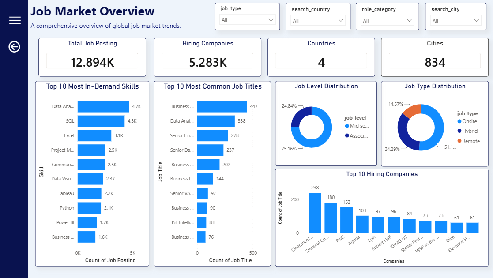
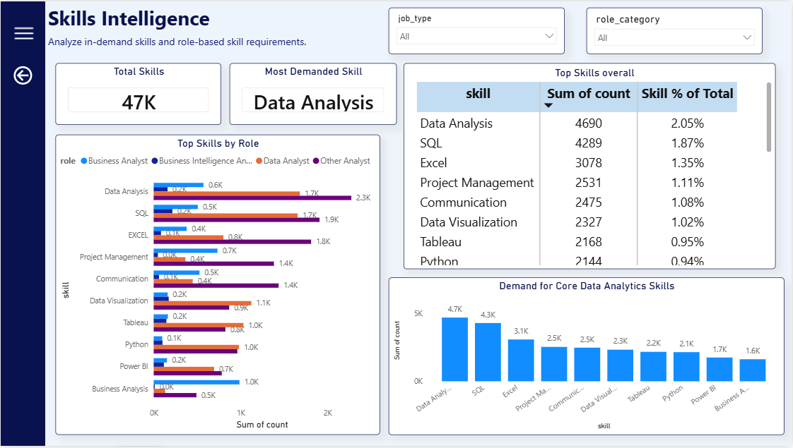
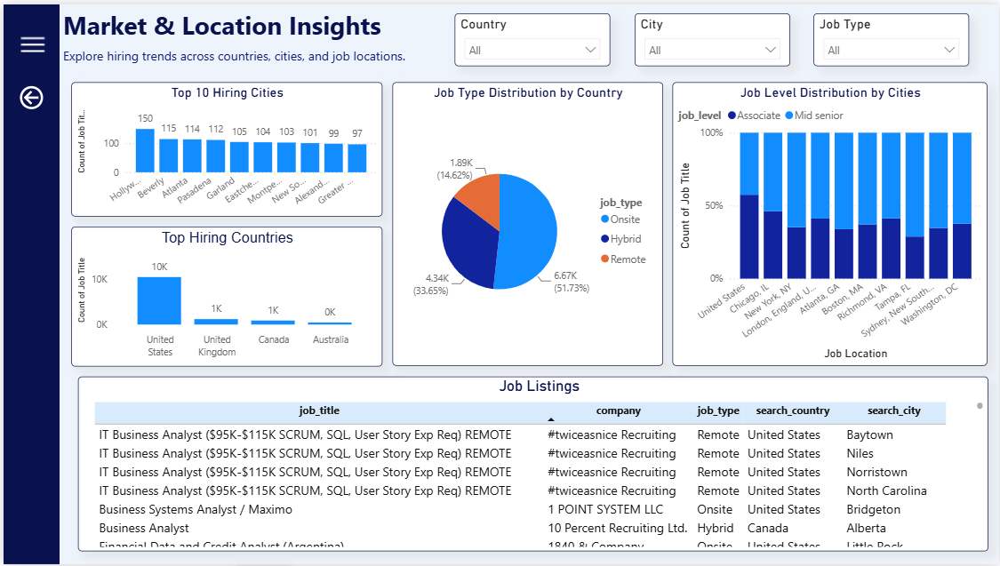

# Job Market Analysis Dashboard

A Power BI dashboard developed to analyze job market trends using a dataset from Kaggle. The dashboard provides insights into job postings, hiring companies, required skills, employment types, and hiring locations through interactive visualizations.

---

## Project Overview

The goal of this project was to transform raw job posting data into meaningful business insights. The dataset was cleaned and explored using Python, followed by data modeling and visualization in Power BI.

The dashboard allows users to:

- Explore overall hiring trends
- Identify the most common job titles
- Analyze the most in-demand skills
- Compare different employment types
- View hiring trends across countries and cities

---

## Dashboard Pages

### Job Market Overview

This page presents a summary of the job market using KPIs and charts.

**Includes:**
- Total Job Postings
- Hiring Companies
- Countries & Cities
- Top 10 Job Titles
- Top 10 Hiring Companies
- Employment Type Distribution
- Job Level Distribution



---

### Skills Intelligence

This page focuses on the demand for technical and analytical skills across job postings.

**Includes:**
- Most Demanded Skill
- Top Skills by Job Role
- Skill Distribution
- Core Analytics Skills



---

### Market & Location Insights

This page provides location-based analysis of job opportunities.

**Includes:**
- Top Hiring Countries
- Top Hiring Cities
- Job Listings by Location
- Employment Type Analysis



---

## Tools Used

- Power BI
- Power Query
- DAX
- Python
- Pandas
- NumPy
- Jupyter Notebook
- Excel

---

## Dataset

The dataset used for this project was obtained from **Kaggle**.

It was cleaned and prepared using Python before being imported into Power BI for analysis.

> Note: The dataset is not included in this repository because of GitHub file size limitations.

---

## Repository Contents

```
Job Market Analysis.pbix
data_exploration.ipynb
README.md
overview.png
skills.png
location.png
```

---

## Key Insights

- Data Analysis is among the most frequently required skills.
- Business Analyst is one of the most common job roles.
- Hybrid and Onsite jobs make up a large share of job postings.
- Hiring opportunities are concentrated across a few major companies and locations.
